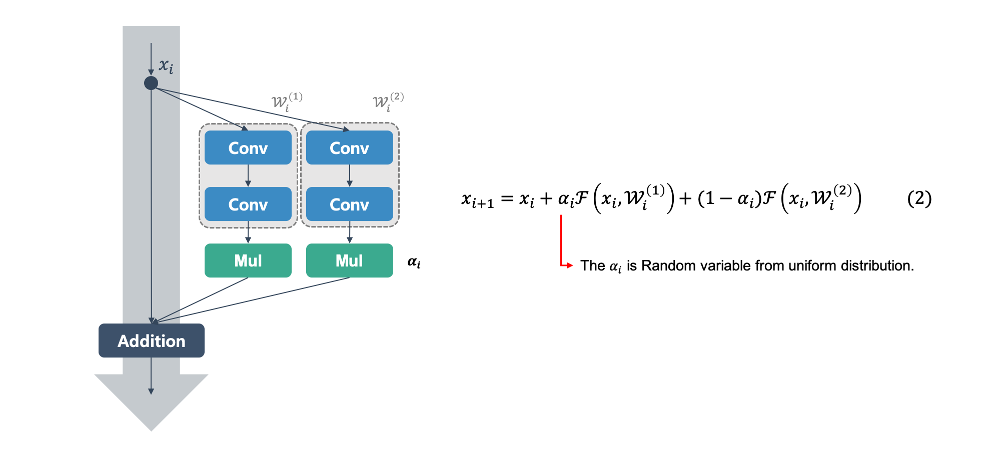
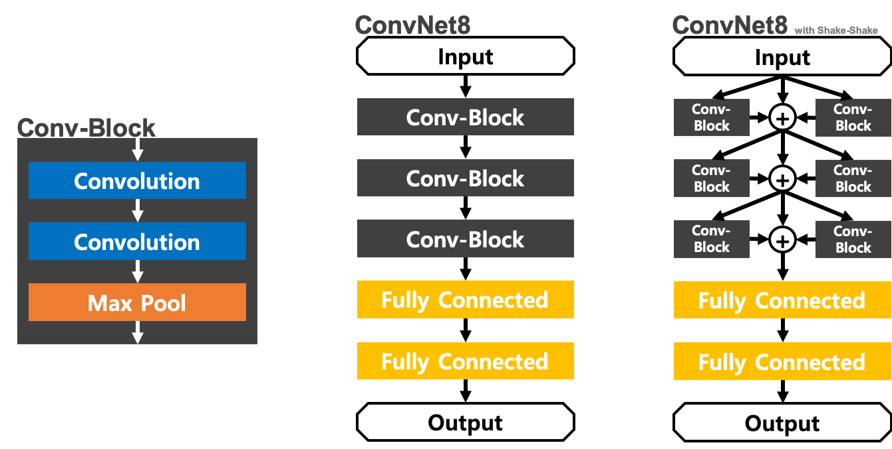

Shake-Shake Regularization
=====

TensorFlow implementation of Shake-Shake Regularization.  

## Concept
<div align="center">
    
  <p>The concept of Shake-Shake Regularization [1].</p>
</div>

## Procedure

The whole procedure for using Shake-Shake Regularization is shown as below. All the figures are redesigned by <a href="https://github.com/YeongHyeon">YeongHyeon</a>.  

<div align="center">
    
  <p>Phase 0. Preparing for Shake-Shake.</p>
</div>

<div align="center">
    
  <p>Phase 1. Forward propagation in training.</p>
</div>

<div align="center">
    
  <p>Phase 2. Backward propagation in training.</p>
</div>

<div align="center">
    
  <p>Phase 3. Forward propagation in test.</p>
</div>

## Performance

The performance is measured using below two CNN architectures.

<div align="center">
    
  <p>Two Convolutional Neural Networks for experiment.</p>
</div>

| |ConvNet8|ConvNet8 with S-S|
|:---|:---:|:---:|
|Accuracy|0.99340|0.99420|
|Precision|0.99339|0.99414|
|Recall|0.99329|0.99408|
|F1-Score|0.99334|0.99410|

### ConvNet8
```
Confusion Matrix
[[ 979    0    0    0    0    0    0    1    0    0]
 [   0 1132    0    1    0    0    1    1    0    0]
 [   0    0 1029    0    0    0    0    3    0    0]
 [   0    0    1 1006    0    3    0    0    0    0]
 [   0    0    1    0  975    0    2    0    0    4]
 [   1    0    0    7    0  882    1    0    0    1]
 [   4    2    0    0    0    1  950    0    1    0]
 [   1    3    3    2    0    0    0 1018    1    0]
 [   3    0    1    1    0    1    0    0  966    2]
 [   0    0    0    1    6    2    0    3    0  997]]
Class-0 | Precision: 0.99089, Recall: 0.99898, F1-Score: 0.99492
Class-1 | Precision: 0.99560, Recall: 0.99736, F1-Score: 0.99648
Class-2 | Precision: 0.99420, Recall: 0.99709, F1-Score: 0.99565
Class-3 | Precision: 0.98821, Recall: 0.99604, F1-Score: 0.99211
Class-4 | Precision: 0.99388, Recall: 0.99287, F1-Score: 0.99338
Class-5 | Precision: 0.99213, Recall: 0.98879, F1-Score: 0.99045
Class-6 | Precision: 0.99581, Recall: 0.99165, F1-Score: 0.99372
Class-7 | Precision: 0.99220, Recall: 0.99027, F1-Score: 0.99124
Class-8 | Precision: 0.99793, Recall: 0.99179, F1-Score: 0.99485
Class-9 | Precision: 0.99303, Recall: 0.98811, F1-Score: 0.99056

Total | Accuracy: 0.99340, Precision: 0.99339, Recall: 0.99329, F1-Score: 0.99334
```

### ConvNet8 with S-S (ConvNet8 + Shake-Shake Regularization)
```
Confusion Matrix
[[ 979    0    0    0    0    0    0    1    0    0]
 [   0 1133    1    0    0    0    1    0    0    0]
 [   0    0 1029    0    0    0    0    3    0    0]
 [   0    0    0 1007    0    2    0    1    0    0]
 [   0    0    0    0  974    0    1    0    0    7]
 [   1    0    0    6    0  884    1    0    0    0]
 [   4    2    0    0    1    2  948    0    1    0]
 [   0    2    1    0    0    0    0 1023    1    1]
 [   1    0    1    2    1    1    0    2  965    1]
 [   0    0    0    0    3    5    0    1    0 1000]]
Class-0 | Precision: 0.99391, Recall: 0.99898, F1-Score: 0.99644
Class-1 | Precision: 0.99648, Recall: 0.99824, F1-Score: 0.99736
Class-2 | Precision: 0.99709, Recall: 0.99709, F1-Score: 0.99709
Class-3 | Precision: 0.99212, Recall: 0.99703, F1-Score: 0.99457
Class-4 | Precision: 0.99489, Recall: 0.99185, F1-Score: 0.99337
Class-5 | Precision: 0.98881, Recall: 0.99103, F1-Score: 0.98992
Class-6 | Precision: 0.99685, Recall: 0.98956, F1-Score: 0.99319
Class-7 | Precision: 0.99224, Recall: 0.99514, F1-Score: 0.99369
Class-8 | Precision: 0.99793, Recall: 0.99076, F1-Score: 0.99433
Class-9 | Precision: 0.99108, Recall: 0.99108, F1-Score: 0.99108

Total | Accuracy: 0.99420, Precision: 0.99414, Recall: 0.99408, F1-Score: 0.99410
```

## Requirements
* Python 3.6.8  
* Tensorflow 1.14.0  
* Numpy 1.17.1  
* Matplotlib 3.1.1  

## Extra Material
<div align="center">
    
  <p>The concept of Shake-Shake that I understood. The figure made by <a href="https://github.com/YeongHyeon">YeongHyeon</a>.</p>
</div>

## Reference
[1] Gastaldi, Xavier. <a href="https://arxiv.org/abs/1705.07485">Shake-Shake Regularization.</a> arXiv preprint arXiv:1705.07485 (2017).
